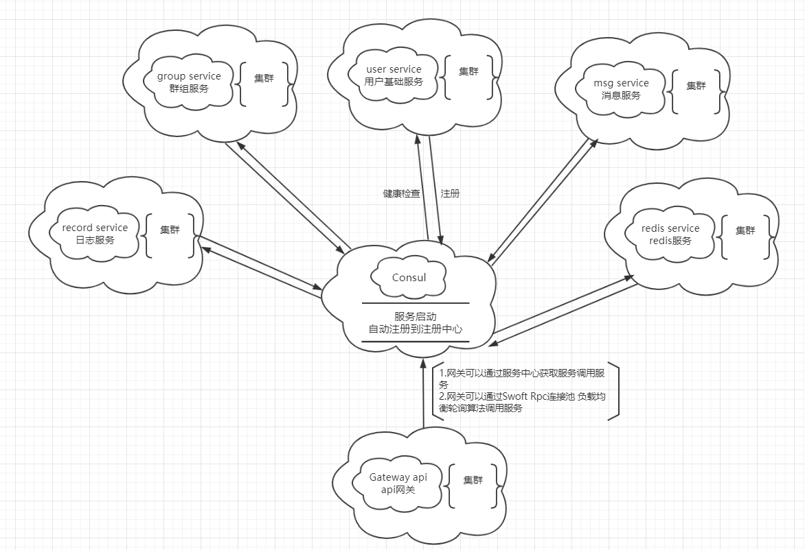
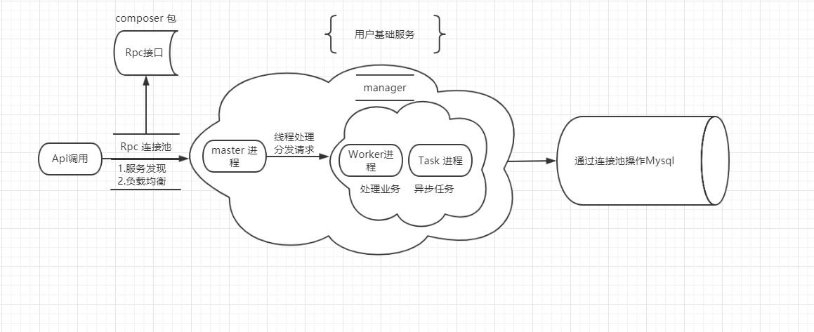
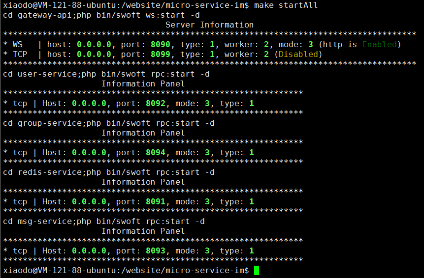

基于Swoft-cloud微服务架构-Im通讯平台
==============

## @概述
+ 对swoole-im进行服务拆分，进行微服务架构(https://www.github.com/brewlin/swoole-im.git)
+ 基于Swoft-cloud 进行服务化治理服务治理、熔断器、服务降级、Rpc调用、服务网关、
Cosul服务注册与发现、Mysql连接池、Redis连接池、异步任务、websocket推送
+ 底层采用Swoole通讯引擎,多进程、异步任务，开发模式：Aop，依赖注入，Bean容器，全注解
+ 服务间配置独立，使用composer进行依赖管理，进行composer组件化开发，公用的Rpc接口封
装为独立composer包。
    - 拆分有群组Rpc服务，聊天日志Rpc服务，用户基础Rpc服务，消息处理服务
    - Httpserver网关api服务，websocket服务
+ 请使用swoole扩展2.1.3+ 以及`php 7.1`!
+ 快速开始
    - 针对每个服务使用composer更新依赖`make install`
    - 开启所有服务 `make start`
    - 关闭所有服务 `make stop`
+ docker启动
    - `docker-compose up`
+ 演示地址 
    - http://im.brewlin.com  (可以注册) 
    - http://chat.brewlin.com  (closed)
    - http://cloud.brewlin.com (soon..)

## @gateway-api-cloud (`soon`)
- 新增im-cloud版本，接入[`im-cloud`](https://github.com/brewlin/im-cloud)分布式推送中间件作为推送中心。
- 新网关中心可替代原有的网关服务，接入im-cloud分布式推送服务
- `im-cloud` 基于swoole原生开发的分布式中间件
- done soon..

## @架构图

### 服务依赖

### 前端服务

### 服务处理

服务开发
=========
### Rpc 接口依赖

    
    "repositories": {
        "0":{
            "type":"vcs",//git源
            "url":"http://www.github.com/brewlin/service-components" //公用composer包
        },
        "packagist": {
            "type": "composer",
            "url": "https://packagist.laravel-china.org"
        }
    }
### Gateway-Api && Websocket 中心网关服务
    接受web端webocket长连接通讯、api请求.
    处理基础数据，对外中心api网关.
    服务调用方(Rpc 调用),调用群组服务、用户基础服务等`
- 依赖: `user-service`、`group-service`、`services-components`、`redis-service`、`group-service`、`msg-service`
- 配置: `worker`:2，`task_worker`:2,`port`:8090,`熔断器`，`服务降级`,Rpc`连接池`，`useProvider`:false,
- 服务启动：

    `cd gateway-api/` 
    
    `composer install`更新依赖
    
    `php bin/swoft ws:start` --d可选守护进程模式
    
### Redis 缓存处理服务
    处理用用户的业务缓存，使用swoft redis连接池
    独立服务处理用户群组缓存、好友聊天缓存
- 依赖:`services-compoents`、`swoft-cloud*`
- 服务启动：

    `cd/redis-service` 
    
    `composer install`更新依赖
    
    `php bin/swoft rpc:start` --d可选守护进程模式
  配置: `worker`:2，`task_worker`:2,`port`:8091,SyncRedis`连接池`，`useProvider`:false,

### Group 群组数据处理服务
    处理用群组基础信息，群组聊天等业务处理
- 依赖:`services-compoents`、`swoft-cloud*`、`redis-service`
- 服务启动：

    `cd/group-service` 
    
    `composer install`更新依赖
    
    `php bin/swoft rpc:start` --d可选守护进程模式
  配置: `worker`:2，`task_worker`:2,`port`:8092,SyncRedis`连接池`，`useProvider`:false,mysql`连接池`

### Msg 消息处理服务
    处理系统消息，收发请求消息存储
   
- 依赖:`services-compoents`、`swoft-cloud*`
- 服务启动：

    `cd ./msg-service` 
    
    `composer install`更新依赖
    
    `php bin/swoft rpc:start` --d可选守护进程模式
  配置: `worker`:2，`task_worker`:2,`port`:8093,`useProvider`:false,mysql`连接池`

### User 用户中心服务
    用户基础信息处理
    用户好友聊天处理
    用户业务功能封装
   
- 依赖:`services-compoents`、`swoft-cloud*`、`redis-service`,`msg-service`,`group-service`
- 服务启动：

    `cd ./user-service` 
    
    `composer install`更新依赖
    
    `php bin/swoft rpc:start` --d可选守护进程模式
  配置: `worker`:2，`task_worker`:2,`port`:8094,`useProvider`:false,mysql`连接池`
  
 ### 启动和服务进程预览

开发进度 && 实现功能
==========
- 好友单聊
- 添加好友
-  websocket token 机制
- 好友右键菜单操作功能
    - 发送好友信息
    - 查看好友资料
    - 查看好友聊天记录
    - 好友备注功能
    - 移动好友分组
    - 删除好友功能
- 发现中心
    - 搜索好友
    - 推荐好友 添加好友
    - 创建群
- 消息中心
    - 好友离线上线通知,好友上线离线消息推送
    - 系统消息推送,好友申请处理操作
    
### 预览
- 消息处理中心，消息盒子

- 发现中心，推荐好友群，搜索好友群，创建群

- 单聊，群聊 聊天界面，聊天记录

- 主面板

- 右键功能（好友管理，分组管理，群管理）

- 整体预览图

